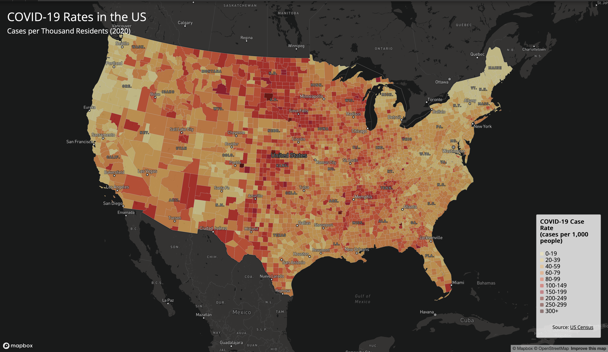
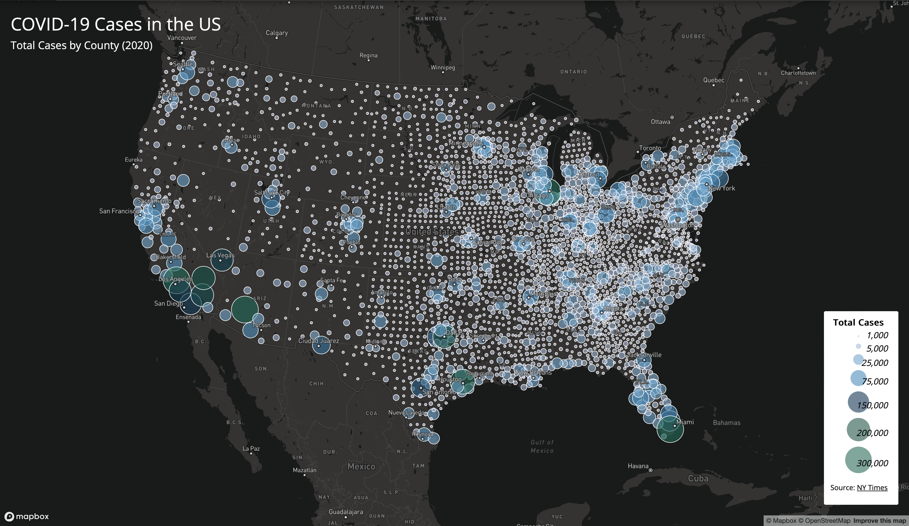

# US COVID-19 Mapping Project

## Project Overview
This project presents two interactive web maps visualizing COVID-19 data across the United States at the county level for the year 2020. The maps provide different perspectives on the pandemic's impact: one showing case rates per thousand residents (choropleth map) and another displaying total case counts (proportional symbol map).

## Map Links
- **Choropleth Map (COVID-19 Rates):** [https://jdeng137.github.io/us_covid_data_viz/map1.html](https://jdeng137.github.io/us_covid_data_viz/map1.html)
- **Proportional Symbol Map (COVID-19 Cases):** [https://jdeng137.github.io/us_covid_data_viz/map2.html](https://jdeng137.github.io/us_covid_data_viz/map2.html)

## Screenshots

### Map 1: COVID-19 Case Rates (Choropleth Map)

*This choropleth map displays COVID-19 case rates per 1,000 residents across US counties, with darker red colors indicating higher infection rates.*

### Map 2: COVID-19 Total Cases (Proportional Symbol Map)

*This proportional symbol map uses graduated circles to represent total COVID-19 cases by county, with larger circles indicating more cases.*

## Primary Functions

### Map 1 - Choropleth Map Features:
- **Color-coded counties** based on COVID-19 case rates (cases per 1,000 people)
- **10-tier classification system** ranging from 0-19 to 300+ cases per thousand
- **Interactive popups** displaying county name, state, case rate, and total cases when clicking on a county
- **Custom legend** with graduated color scheme from light yellow to dark red
- **Layer ordering** ensuring city/place labels render on top of the data layer for better readability

### Map 2 - Proportional Symbol Map Features:
- **Graduated circle symbols** sized proportionally to total COVID-19 case counts
- **7 size classes** ranging from 1,000 to 300,000+ cases
- **Color gradation** with darker blues indicating higher case counts
- **Interactive popups** showing detailed county information and case numbers on click
- **Hover effects** changing cursor to pointer when over clickable circles
- **Optimized symbol placement** ensuring labels remain visible above data points

### Advanced Features Not Covered in Lectures:
1. **Symbol layer ordering** - Implementation of code to find and insert data layers before the first symbol layer in the basemap, ensuring labels appear on top:
```javascript
   const layers = map.getStyle().layers;
   let firstSymbolId;
   for (let i = 0; i < layers.length; i++) {
       if (layers[i].type === 'symbol') {
           firstSymbolId = layers[i].id;
           break;
       }
   }
   map.addLayer({...}, firstSymbolId);
```

2. **Extended classification ranges** - Custom implementation of expanded data ranges (up to 300+) to better represent outlier counties with extremely high case rates

## Libraries and Technologies Used
- **Mapbox GL JS v2.8.1** - Interactive map rendering and visualization
- **HTML5/CSS3** - Structure and styling
- **JavaScript (ES6)** - Map functionality and interactivity
- **Google Fonts (Open Sans)** - Typography

## Map Specifications
- **Projection:** Albers USA
- **Center:** [-96, 37.5] (Centered on continental US)
- **Zoom Level:** 4
- **Basemap:** Mapbox Dark (dark-v10)

## Data Sources
- **COVID-19 Case Data:** [The New York Times COVID-19 Data](https://www.nytimes.com/interactive/2020/us/coronavirus-us-cases.html)
  - Includes all cases reported in 2020 at the county level
- **Population Data:** [US Census Bureau, 2018 ACS 5-Year Estimates](https://data.census.gov/cedsci/table?g=0100000US.050000&d=ACS%205-Year%20Estimates%20Data%20Profiles&tid=ACSDP5Y2018.DP05)
  - Used to calculate case rates per 1,000 residents
- **County Boundaries:** US Census Bureau
  - Simplified using Mapshaper for optimal web performance

## Data Processing
The GeoJSON data files were processed to:
- Use Albers USA projection for accurate US mapping
- Remove unnecessary attributes to reduce file size
- Simplify geometric shapes using Mapshaper for faster loading
- Calculate case rates as cases per thousand residents

## Project Structure
```
us-covid-2020-maps/
│
├── map1.html                          # Choropleth map
├── map2.html                          # Proportional symbol map
├── README.md                          # Project documentation
│
├── assets/
│   ├── us-covid-2020-rates.json      # County-level case rates data
│   └── us-covid-2020-counts.json     # County-level case counts data
│
├── css/
│   └── style.css                      # Custom styling (if separated)
│
├── img/
│   ├── map1-screenshot.png           # Screenshot of choropleth map
│   └── map2-screenshot.png           # Screenshot of proportional symbol map
│
└── js/
    └── main.js                        # JavaScript functionality (if separated)
```

## Acknowledgments
- Lab designed by Professor Bo Zhao, University of Washington
- COVID-19 data processing by Steven Bao
- Course: GEOG 458 - Advanced Digital Geographies

## Author
Jiali Deng

## License
This project was created for educational purposes as part of GEOG 458 at the University of Washington.